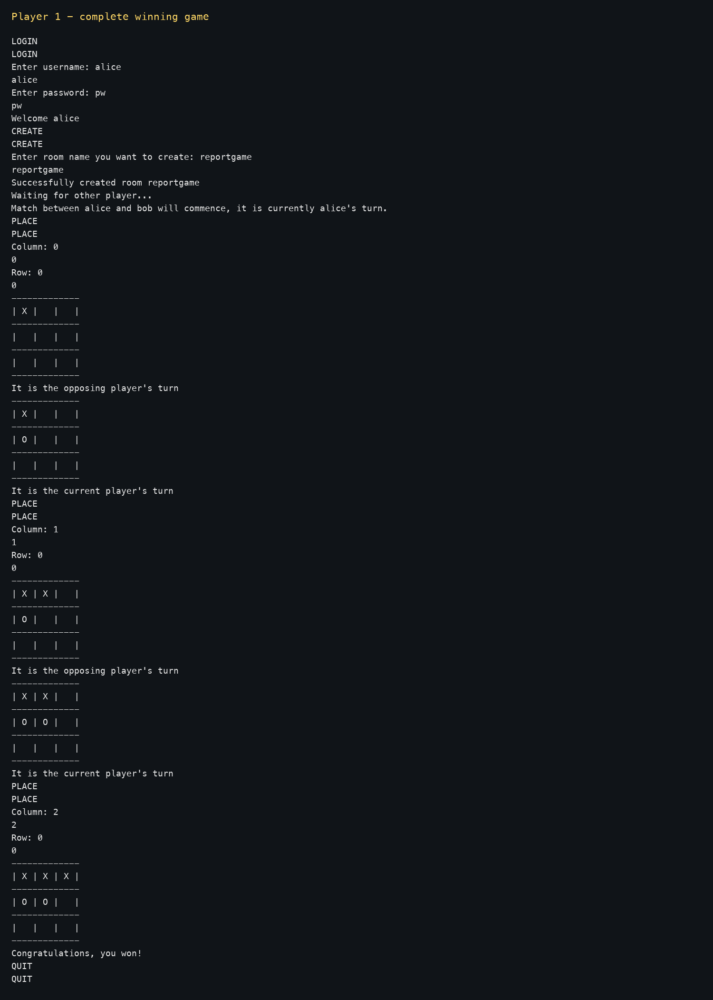
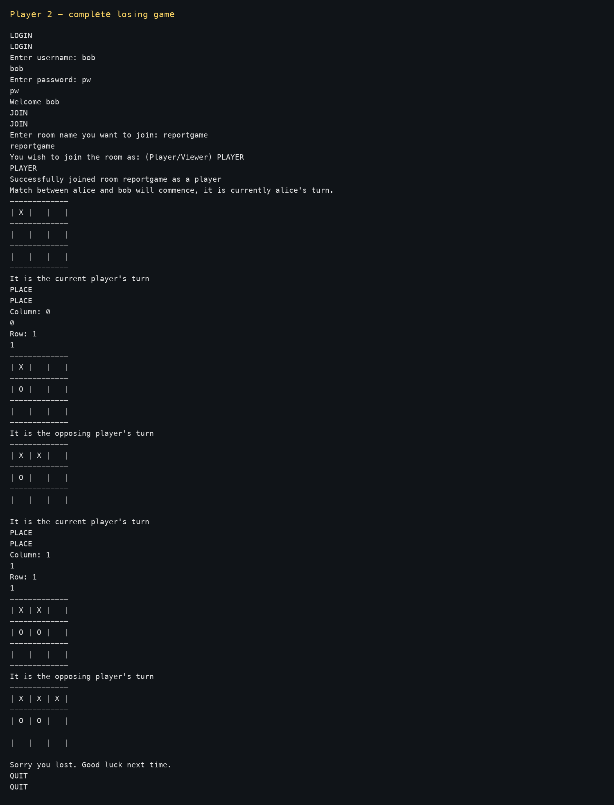
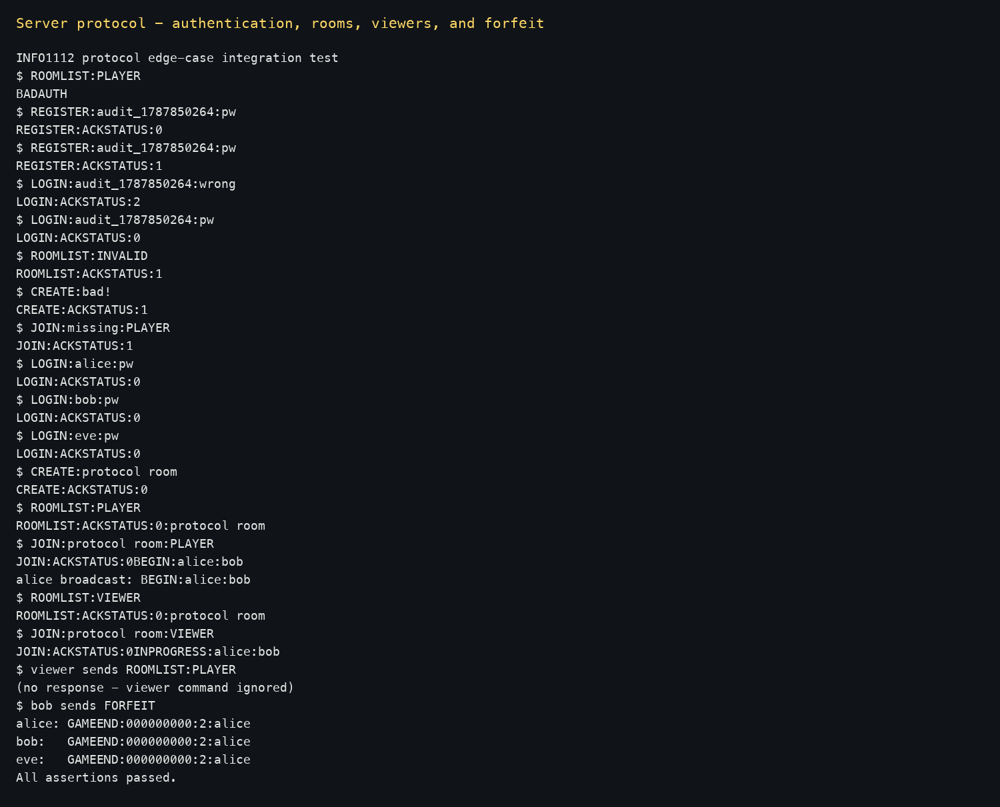

# Test Report

## Features tested

- Server/client argument counts, connection failures, configuration paths, JSON errors, missing keys, port range, user-database shape, record shape, and tilde expansion.
- `REGISTER` and `LOGIN` success plus every acknowledgement error status; bcrypt hashes were reopened and verified from the database file.
- Authentication enforcement with `BADAUTH`; game commands outside rooms with `NOROOM`.
- Room names (including spaces, dashes, and underscores), invalid names, duplicates, the 256-room limit, and room deletion after games.
- `ROOMLIST` and `JOIN` in player/viewer modes, invalid modes, missing/full rooms, `BEGIN`, and `INPROGRESS` turn order.
- Two-player turns, coordinate type/range/occupancy validation, X/O placement, `BOARDSTATUS` encoding, and broadcasts to both players and viewers.
- Horizontal, vertical, and diagonal wins; draws; explicit forfeits; implicit disconnect forfeits; `GAMEEND` status codes and winner names.
- Viewer messages being ignored, `QUIT`/EOF cleanup, unknown server messages, concurrent rooms, and TCP packets containing multiple server messages.

## Method and results

Black-box tests launched the submitted server and up to four real TCP clients. Assertions compared every received protocol string with the specification. Separate subprocess tests checked startup errors and malformed configuration/database fixtures. Client sessions were driven through their normal prompts, so the screenshots contain the commands entered and the resulting output. All tests passed.

### Complete game - player one

This run covers login, room creation, waiting for player two, alternating turns, board rendering, and the winning response.

### Complete game - player two

This simultaneous run covers joining, waiting for the opposing player, placing O markers, board updates, and the losing response.

### Protocol and edge cases

This socket-level run shows registration/login failures, authentication enforcement, invalid room/mode handling, room lists, player/viewer joins, coalesced TCP messages, ignored viewer input, and a forfeited game broadcast to every member.

Automated win/draw matrices exercised all eight winning lines and a full draw board. A forced player socket closure produced `GAMEEND:000000000:2:alice` for the remaining player. No feature is unimplemented.
